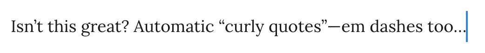

# Smart Typography Refresh

A maintained, modernized fork of [mgmeyers/obsidian-smart-typography](https://github.com/mgmeyers/obsidian-smart-typography) — the Obsidian plugin that rewrites ASCII punctuation into proper typographic glyphs as you type. Upstream has been unmaintained for years; this refresh modernizes the toolchain, drops dead code, and adds a real test suite so bug-fixes and new features have a clean base to land on.

It ships under its **own plugin id (`smart-typography-refresh`)**, so it installs and runs alongside the original without clashing. It's **not** in the Community Plugins store — install it via BRAT or manually (see below).

## What it converts

As you type (any automatic change can be undone by pressing **Backspace** immediately after):

- `""` → `“”` — curly double quotes (customizable)
- `''` → `‘’` — curly single quotes (customizable)
- `...` → `…` — ellipsis
- `->` → `→`, `<-` → `←` (customizable)
- `<<` → `«`, `>>` → `»` (customizable)
- `--` → `–` (en dash), `–-` → `—` (em dash), `—-` → `---`
  - or, with **Skip en-dash** on, `--` → `—` directly
- Comparisons: `<=` → `≤`, `>=` → `≥`, `/=` → `≠`
- Fractions (opt-in): `1/2` → `½`, plus `⅓ ⅔ ¼ ¾ ⅕ ⅖ ⅗ ⅘ ⅙ ⅚ ⅐ ⅛ ⅜ ⅝ ⅞ ⅑ ⅒`

Each feature has a toggle (and, where relevant, a custom-glyph field) in the plugin's settings tab.



## Excluding files from correction

Code blocks and inline code are skipped automatically. To exclude **whole files or folders** (snippet libraries, templates, anything where auto-correction would do damage), list their vault-relative paths under **Ignored paths** in settings — one per line:

```
Code
Templates/daily.md
```

Everything under a listed folder is ignored. You can also override a single note from its frontmatter — this wins over the path list:

```yaml
---
smart-typography: false   # never correct this note
# smart-typography: true  # force correction on, even inside an ignored folder
---
```

## What's different from upstream

- **Modernized stack**: [Bun](https://bun.com) + [Vite+](https://voidzero.dev) (`vp`) as a unified build/lint/format/test toolchain, [Vitest](https://vitest.dev), strict [oxlint](https://oxc.rs) + oxfmt, TypeScript 6. (Was Rollup + Yarn.)
- **CodeMirror 6 only.** The legacy CodeMirror 5 code path was removed — it is unreachable on Obsidian 1.0+. `minAppVersion` is now `1.0.0`.
- **`src/` layout** with the replacement engine extracted into pure, unit-tested modules.
- New plugin **id `smart-typography-refresh`** — distinct from the original (`obsidian-smart-typography`), so the two install side by side; this one starts with fresh settings.

## Install

Not in the Community Plugins store — use one of:

### BRAT (recommended — auto-updates)

1. Install **[BRAT](https://github.com/TfTHacker/obsidian42-brat)** from Community Plugins and enable it.
2. Run the command **BRAT: Add a beta plugin**, enter the repo `delfianto/smart-typography-refresh`, and keep **Latest version**.
3. Enable **Smart Typography Refresh** under Settings → Community Plugins.

BRAT then keeps it up to date as new releases ship.

### Manual

1. Download `main.js` and `manifest.json` from the [latest release](https://github.com/delfianto/smart-typography-refresh/releases/latest) — or build from source with `bun install && bun run build` (output in `dist/`).
2. Create `<your-vault>/.obsidian/plugins/smart-typography-refresh/` and copy both files into it.
3. Reload Obsidian (or toggle Community Plugins off and on) and enable **Smart Typography Refresh**.

## Development

Requires [Bun](https://bun.com).

```bash
bun install          # install dependencies
bun run dev          # watch build → deploys into a vault (see below)
bun run build        # production bundle → dist/
bun run test         # run the Vitest suite
bun run test:coverage
bun run check        # format + lint (oxfmt + oxlint)
bun run type-check   # tsc --noEmit
```

For `bun run dev`, copy `.envrc.example` to `.envrc` and point `PLUGINS_DIR` at your vault's `.obsidian/plugins` directory (with [direnv](https://direnv.net)); the watch build then deploys straight into `$PLUGINS_DIR/smart-typography-refresh/`. Without it, watch mode falls back to the in-repo `test-vault/`.

See [MODERNIZATION.md](./MODERNIZATION.md) for the migration details.

## License

[GPL-3.0](./LICENSE.md), inherited from upstream.
